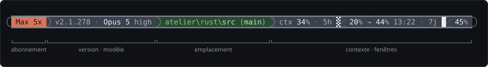

# statusline

Ligne de statut pour [Claude Code](https://claude.com/claude-code) sous
Windows : abonnement, version, modèle et effort, emplacement, contexte et
fenêtres de limitation — dans une capsule à compartiments colorés, rendue par
un binaire Rust en une quinzaine de millisecondes.

```
 ▁▁▁▁▁▁▁▁▁▁▁▁▁▁▁▁▁▁▁▁▁▁▁▁▁▁▁▁▁▁▁▁▁▁▁▁▁▁▁▁▁▁▁▁▁▁▁▁▁▁▁▁▁▁▁▁▁
 Pro  v2.1.259 · Opus 5 xhigh  PY_xl\PyScripts\_plus-rust_ 
 ▔▔▔▔▔▔▔▔▔▔▔▔▔▔▔▔▔▔▔▔▔▔▔▔▔▔▔▔▔▔▔▔▔▔▔▔▔▔▔▔▔▔▔▔▔▔▔▔▔▔▔▔▔▔▔▔▔
 ▁▁▁▁▁▁▁▁▁▁▁▁▁▁▁▁▁▁▁▁▁▁▁▁▁▁▁▁▁▁▁▁▁▁▁▁▁▁▁▁▁▁▁▁▁▁
 ctx 34% · 5h ▒░ 20% → 41% 15:00 · 7j █░ 45% 
 ▔▔▔▔▔▔▔▔▔▔▔▔▔▔▔▔▔▔▔▔▔▔▔▔▔▔▔▔▔▔▔▔▔▔▔▔▔▔▔▔▔▔▔▔▔▔
```

Ici la forme dépliée, celle d'une console étroite ; sur une console large la
capsule tient sur un rang :



Le **[guide utilisateur](guide.html)** montre chaque cas d'usage — abonnements,
marqueurs, emplacement, jauge, projections, paliers, repli en largeur — sur de
vraies sorties du binaire, et les explique. Sous `NO_COLOR`, tout ce qui n'est
que forme se retire :

```
Pro v2.1.259 · Opus 5 xhigh PY_xl\PyScripts\_plus-rust_ ctx 34% · 5h ▒░ 20% → 41% 15:00 · 7j █░ 45%
```

## Ce qu'elle affiche

| Segment | Source |
|---|---|
| Abonnement (Pro, Max 5x/20x, Team, Enterprise) | `oauthAccount` de `~/.claude.json` — le payload n'en dit rien |
| Version de Claude Code | métadonnées du binaire installé |
| Modèle, fenêtre au-delà de 200 k, effort, marqueurs `fast` / `sans réflexion` | payload |
| Emplacement relatif au projet, branche Git | payload, `.git/HEAD` |
| Contexte occupé | payload, paliers 80 / 90 % |
| Fenêtre 5 h : jauge, valeur, projection à la remise à zéro ou `épuisé`, heure | payload + rythme mesuré, mémorisé dans un cache |
| Fenêtre 7 j : jauge, valeur, marqueurs `~` (mémorisée) et `≈` (estimée) | la plus remplie de la fenêtre globale et de la fenêtre propre au modèle relevée par `/usage` ; seuils selon la famille du modèle |

Les compartiments prennent le fond du pire palier atteint — ardoise, ambre
sombre à l'alerte, rouge sombre au critique. Chaque segment absent se retire
de lui-même ; la ligne n'est jamais vide et le programme rend toujours 0 : une
sortie vide effacerait la ligne dans l'interface, ce qui est pire qu'une
information partielle.

## Installation

Prérequis : Windows 10 ou 11. Windows Terminal est conseillé : il trace
lui-même les arcs Powerline (`U+E0B5`, `U+E0B7`) et les blocs du cadre, sans
police particulière.

Sans compiler : la dernière Release porte le binaire x64,
[`statusline.exe`](https://github.com/gnash1971/statusline/releases/latest/download/statusline.exe).
Avec Rust stable :

```bat
cd statusline-rs
cargo build --release
rem -> target\release\statusline.exe, à copier où l'on veut,
rem    par exemple %USERPROFILE%\.claude\statusline.exe
```

Puis, dans `%USERPROFILE%\.claude\settings.json` :

```json
"statusLine": {
  "type": "command",
  "command": "\"C:/chemin/vers/statusline.exe\"",
  "padding": 0,
  "refreshInterval": 1
}
```

`compiler-statusline.bat` enchaîne les deux — compilation, puis dépôt dans
`%USERPROFILE%\.claude` par `.new` / `.old`, un exécutable en cours d'usage ne
pouvant être écrasé mais bien renommé.

## Contenu du dépôt

| Chemin | Rôle |
|---|---|
| `statusline-rs/` | Le crate : `serde_json` et `windows-sys`, rien d'autre ; seize modules, tests unitaires à attendus figés |
| `statusline.ps1` | Le script PowerShell d'origine : **oracle** du harnais, et repli sans compilation |
| `test-statusline.ps1` | Harnais de non-régression : les cas sont rejoués dans un `%LOCALAPPDATA%` isolé, sortie 1 à la première divergence |
| `compiler-statusline.bat` | Compile et déploie ; `/test` fait précéder le dépôt des tests du crate et du harnais, `/check` compile et compare sans rien écrire |
| `analyser-journal.ps1` | Active, arrête et dépouille le journal de diagnostic du binaire |
| `docs/statusline-rust.md` | Le dossier du portage et de chacune de ses évolutions, daté |
| `guide.html`, `guide/` | Le guide utilisateur illustré ; `guide/generer-guide.ps1` régénère ses figures à partir du binaire, dans un bac isolé |

## Tests

```bat
cd statusline-rs
cargo test
cd ..
pwsh -File test-statusline.ps1
compiler-statusline.bat /check
```

Depuis la capsule (2.0.0), l'oracle est gelé : sous couleur, la sortie du
binaire a une autre forme — fonds, caps, cadre — et le harnais compare les deux
sous `NO_COLOR`, où elle est, octet pour octet, celle du script. Les cas
colorés sont couverts par les tests du crate.

La CI (`.github/workflows/ci.yml`) rejoue `cargo test`, `cargo build
--release` et `cargo fmt --check` sur Windows à chaque push sur `main` ;
`clippy -D warnings` y tourne en non bloquant tant que trois lints connus ne
sont pas corrigés.

## État

Version 2.2.0 — capsule cadrée sur trois rangs. L'histoire, les mesures et les
décisions sont dans `docs/statusline-rust.md`.

## Licence

À définir.
